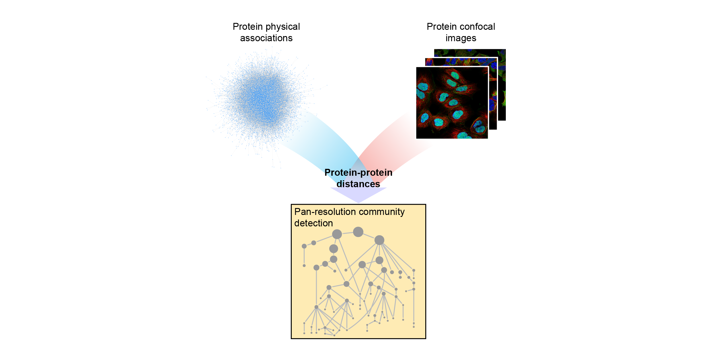

# Multi-Scale Integrated Cell (MuSIC)



The eukaryotic cell is a multi-scale structure with modular organization across at least four orders of magnitude. Two central approaches for mapping this structure – protein fluorescent imaging and protein biophysical association – each generate extensive datasets, but of distinct qualities and resolutions that are typically treated separately. Here, we integrate immunofluorescence images in the Human Protein Atlas with affinity purification experiments from the BioPlex resource to create a unified hierarchical map of eukaryotic cell architecture. Integration involves configuring each approach to produce a general measure of protein distance, then calibrating the two measures using machine learning. The evolving map is called the Multi-Scale Integrated Cell (MuSIC).

Please cite **[Qin et al., “Mapping cell structure across scales by fusing protein images and interactions”](https://www.biorxiv.org/cgi/content/short/2020.06.21.163709v1)**.

## Installation
Anaconda users please either install relevant packages with the following command lines
```
conda env create -f ./installation/environment.yml
source activate music
```
or using requirements.txt if the yml file is not compatible with the user's platform.
```
conda create -n music python=3.6.2 anaconda
source activate music
pip install -r ./installation/requirements.txt
```

To perform pan-resolution community detection as in MuSIC, **please install:**
- [CliXO v1.0](https://github.com/fanzheng10/CliXO-1.0)
- [DDOT](https://github.com/michaelkyu/ddot)
	- **Note:** the dependencies are already satisfied, but users need to **follow instructions in section *Install the ddot Python package*** to complete installation. 
- [alignOntology](https://github.com/mhk7/alignOntology)
	- **Note:** DDOT has alignOntology in `/ddot/alignOntology` folder. If user has trouble installing  alignOntology from GitHub, user can use path to alignOntology in DDOT for the `--path_to_alignOntology` parameter in the community detection section.

## [Step-by-step guide to build MuSIC v1](Step-by-step%20guide%20to%20build%20MuSIC%20v1.ipynb)

## [User Manual](https://github.com/idekerlab/MuSIC/wiki/User-Manual)

## How to download MuSIC v1?
The [MuSIC v1](http://www.ndexbio.org/?#/network/7fc70ab6-9fb1-11ea-aaef-0ac135e8bacf?accesskey=68afa0480a4859906b5d221619ee95679da96059680557f65c3dd9f1842e4930) network is shared via NDEx and can be downloaded to Cytoscape by clicking the "Open in Cytoscape" button at the bottom-right of the web page.
- NDEx, the Network Data Exchange (www.ndexbio.org, Pratt et. al. 2017 DOI: 10.1158/0008-5472.CAN-17-0606), is an online commons for biological networks where networks of many types and formats can be shared, accessed, and stored by users and applications. 

## Data Availability
- All immunofluorescence images used in this study are available at https://www.proteinatlas.org/.
- The [BioPlex 2.0](http://test.ndexbio.org/#/network/164d426d-b185-11ea-a4d3-0660b7976219) input network and the [newly generated AP-MS data](http://www.ndexbio.org/#/network/62f6c8f5-a05b-11ea-aaef-0ac135e8bacf?accesskey=06f0739d6558f98b222ce8e53d35d9a6788b589cbf0d529b00e730aeba35c31d) in this study can be accessed via NDEx. AP-MS data, including filtered and unfiltered interaction lists as well as raw mass spectrometry data, are also available at http://bioplex.hms.harvard.edu.

## Collaborators


[**Ideker Lab**](https://idekerlab.ucsd.edu/)

[**Yeo Lab**](https://yeolab.github.io/)


<p float="left">
  
  
</p>

[**Lundberg Lab**](https://cellprofiling.org/)

<br/>


[**Harper Lab**](https://harper.hms.harvard.edu/)

[**Gygi Lab**](https://gygi.hms.harvard.edu/index.html)

<br/>


[**Lafontaine Lab**](https://www.lafontainelab.com/)
